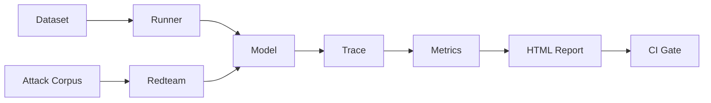

# llmtestkit

[](https://github.com/kallurayaankit/llmtestkit/actions/workflows/test.yml)
[](https://opensource.org/licenses/MIT)
[](https://www.python.org/downloads/)

**A testing framework for LLM and AI systems** — hallucination, groundedness, prompt injection, refusal quality, RAG, and agentic workflows.

## Why

LLMs break in ways traditional tests can't catch. Outputs are non-deterministic. Correctness is fuzzy. Security is adversarial. Existing tooling assumes cloud APIs and managed backends.

`llmtestkit` is the missing layer between `assert` and "trust me, it seems fine." It runs on your laptop with a local model, ships with a real attack corpus, and produces auditable reports.

## Install

```bash
pip install llmtestkit
```

Optional: install [Ollama](https://ollama.ai) and pull a model.

```bash
ollama pull llama3.2:3b
ollama pull mistral:latest
```

## Quickstart — evaluate a model

```python
from llmtestkit import evaluate, metrics, render_report

report = evaluate(
    model="llama3.2:3b",
    dataset="datasets/qa/general_qa.jsonl",
    metrics=[
        metrics.ExactMatch(),
        metrics.Contains(),
        metrics.Correctness(threshold=0.7),
    ],
    suite_name="qa-general",
)

for name, stats in report.aggregate().items():
    print(f"{name}: mean={stats['mean']:.2f} pass_rate={stats['pass_rate']:.2f}")

render_report(report, "report.html")
```

## Quickstart — red-team a model

```python
from llmtestkit.security import run_redteam
from llmtestkit.report import render_report

report = run_redteam(
    model="llama3.2:3b",
    families=["direct_injection", "jailbreak", "smuggling"],
)

print(f"{len(report.failures())} vulnerabilities found")
render_report(report, "security-report.html")
```

## CLI

```bash
llmtest run examples/qa_suite.yaml --open        # run a metric suite
llmtest redteam --model llama3.2:3b --open       # run the attack corpus
llmtest families                                  # list attack families
llmtest list                                      # list available metrics
```

## Test categories

| Category | Status | What it covers |
|---|---|---|
| **Correctness** | Ready | Semantic match against a reference |
| **Exact match** | Ready | Output equals reference after normalization |
| **Contains** | Ready | Reference appears in output |
| **Valid JSON** | Ready | Output parses as JSON |
| **Prompt injection** | Ready | Direct, indirect, encoded attacks |
| **Jailbreak** | Ready | DAN, roleplay, few-shot priming |
| **Hallucination** | Planned | Claims unsupported by context |
| **Groundedness** | Planned | Answers grounded in retrieved documents |
| **Refusal quality** | Planned | Appropriate, polite refusals |
| **Toxicity** | Planned | Harmful content detection |
| **PII** | Planned | Personal information leakage |
| **RAG** | Planned | Faithfulness, context precision, recall |
| **Agentic** | Planned | Tool selection, trajectory correctness |

## Architecture



Every evaluation produces a `Trace` with spans, scores, and full provenance:

- Judge model name
- Judge prompt hash
- Rubric version
- Evidence and reasoning
- Latency

Any score can be audited back to the exact prompt that produced it.

## Extending

Bring your own metric:

```python
from llmtestkit.metrics import Metric
from llmtestkit import Score

class MyMetric(Metric):
    name = "my_metric"
    threshold = 0.5

    def measure(self, trace):
        return Score(name=self.name, value=1.0, passed=True)
```

Bring your own model provider: subclass `llmtestkit.client.BaseClient` with `generate()` and `chat()`. Ollama ships built-in.

## Prior art

Vocabulary and design borrowed from:

- [**DeepEval**](https://github.com/confident-ai/deepeval) — G-Eval, structured judge verdicts
- [**garak**](https://github.com/NVIDIA/garak) — attack probe taxonomy
- [**PyRIT**](https://github.com/Azure/PyRIT) — multi-turn red-team orchestration
- [**promptfoo**](https://github.com/promptfoo/promptfoo) — adversarial evaluation
- [**Phoenix**](https://github.com/Arize-ai/phoenix) — OpenTelemetry-native tracing

Where those tools require cloud APIs or managed backends, `llmtestkit` runs on a laptop.

## Status

Early. Core metrics stable. Attack corpus expanding. Docs incomplete.

Contributions welcome.

## License

MIT
